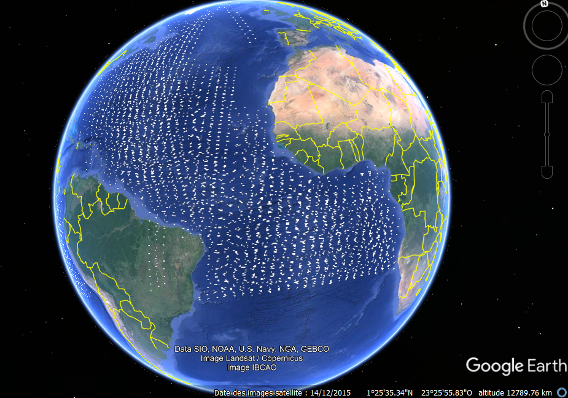
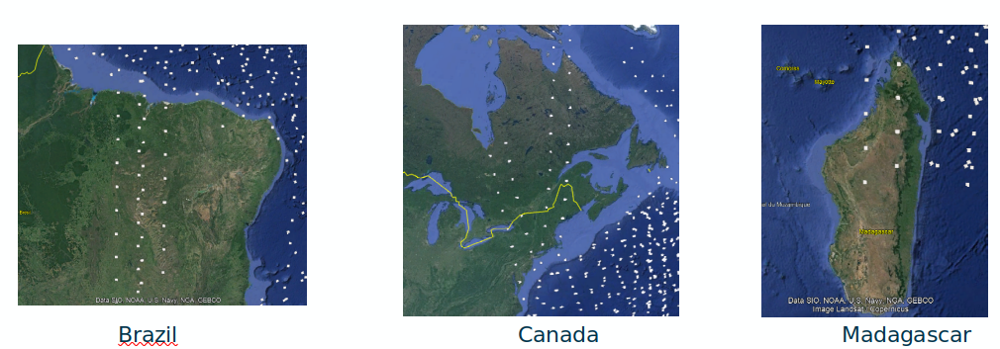
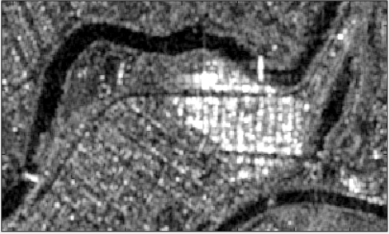
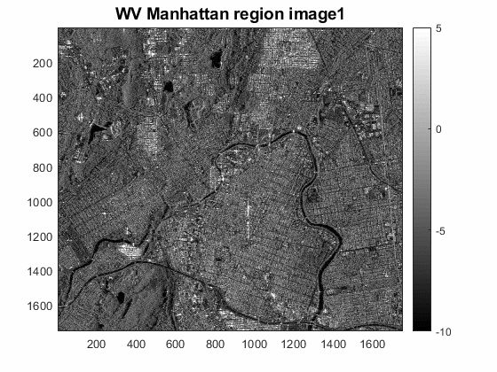

# Ongoing Project, Sentinel-1 WV mode SLC Data process

This is the repository for the code allowing to process Sentinel-1 WV mode SLC Data. This is an ongoing project, some functions are still to be checked and others will be added.


## File Exploration

The most important files are:

 - WV_PROCESSING_Automatic.ipynb notebook: this file contains the function used to unzip data and create a calibrated stack of selected swath
 - the shapefiles in the Shapefiles repository: it allows to see, using Google Earth Engine for example, the location of available data every 6 month. A jupyter notebook for online visualisation is going to be created soon.

## Installation
I advise the use of Anaconda distribution to run the code of this project. An anaconda environment file has been generated and can be used to create a new working environment using the following command:
```
conda env create -f environment.yml
```


## Execution
To execute the main code of this project, you can start a jupyter notebook and then run the WV_PROCESSING_Automatic.ipynb. The path and swath variables have to be edited.

## Available Data





## Results




## Future updates




